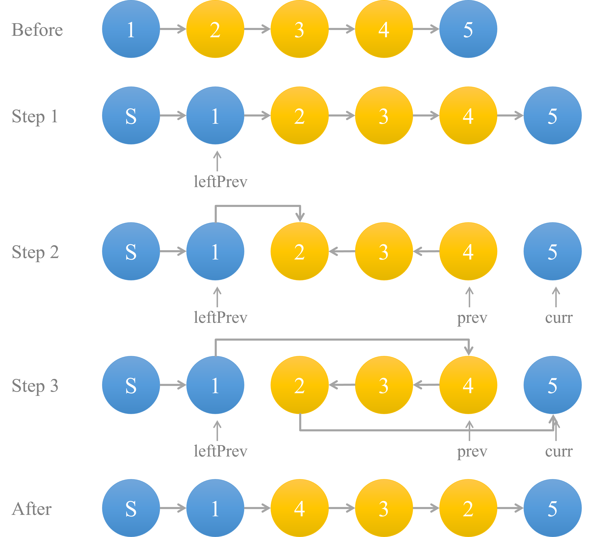
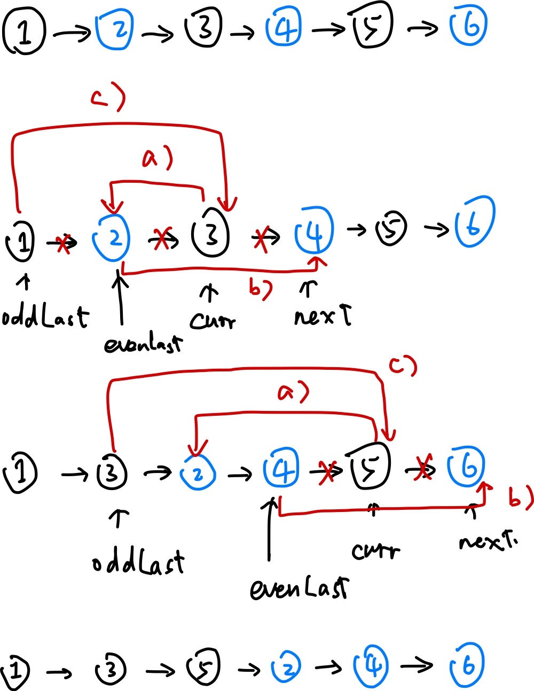

reference: https://zhuanlan.zhihu.com/p/349940945

# Sort

| No.                            | Difficult | Tags                         | Last Completed | High-F |
| ------------------------------ | --------- | ---------------------------- | -------------- | ------ |
| 148. Sort List                 | Medium    | Merge Sort, Linked List      | 2022-04-27     |        |
| 56. Merge Intervals            | Medium    | Sort                         | 2022-05-01     |        |
| 27. Remove Elements            | Easy      | Two pointers                 | 2022-05-01     |        |
| 179. Largest Number            | Medium    | String, Comparator           | 2022-05-01     |        |
| 75. Sort Colors                | Medium    | Two pointers                 | 2022-05-08     |        |
| **215. Kth Largest Element**   | Medium    | Randomized-select, Heap sort | 2022-05-09     | True   |
| 4. Median of Two Sorted Arrays | Hard      | Binary search                | 2022-05-09     | True   |
|                                |           |                              |                |        |
|                                |           |                              |                |        |

## 4. Median of Two Sorted Arrays

### Approach 1: Binary Search

- Time complexity: Θ(log(m + n))
- Space complexity: Θ(1)

```java
class Solution {
    public double findMedianSortedArrays(int[] nums1, int[] nums2) {
        int n = nums1.length + nums2.length;
        if ((n & 1) == 1) {
            return findKthElement(nums1, nums2, n / 2 + 1);
        } else {
            return (double) (findKthElement(nums1, nums2, n / 2 + 1) + findKthElement(nums1, nums2, n / 2)) / 2;
        }
    }
    
    private int findKthElement(int[] nums1, int[] nums2, int k) {
        int p1 = 0, p2 = 0;
        int newP1, newP2;
        while (true) {
            if (p1 == nums1.length) {
                return nums2[p2 + k - 1];
            }
            if (p2 == nums2.length) {
                return nums1[p1 + k - 1];
            }
            if (k == 1) {
                return Math.min(nums1[p1], nums2[p2]);
            }
            newP1 = Math.min(p1 + k / 2 - 1, nums1.length - 1);
            newP2 = Math.min(p2 + k / 2 - 1, nums2.length - 1);
            if (nums1[newP1] < nums2[newP2]) {
                k -= newP1 - p1 + 1;
                p1 = newP1 + 1;
            } else {
                k -= newP2 - p2 + 1;
                p2 = newP2 + 1;
            }
        }
    }
}
```


## 27. Remove Element

### Approach 1: Two pointers-when elements to remove are many

Use fast pointer `j` to iterate the element in the array and slow pointer `i` to record the last position of the elements that  are not equal to the `val`. If `nums[j] ≠ val`, we copy `nums[j]` to `nums[i]` and increment both indexes. Otherwise, only increment `j`.

Complexity analysis:

- Time complexity: Θ(N)
- Space complexity: Θ(1)

```java
class Solution {
    public int removeElement2(int[] nums, int val) {
        int i = 0;
        for (int j = 0; j < nums.length; j++) {
            if (nums[j] != val) {
                nums[i++] = nums[j];
            }
        }
        return i;
    }
}
```

### Approach 2: Two pointers-when elements to remove are rare

Approach 1 has a disadvantage: if there are few elements equal to the `val`, this program will execute the step `nums[i++] = nums[j];` too many times. For example, nums=[1,2,3,5,4], val=4. In this case, it's better to directly move the elements equal to `val` to the end of the array and reduce the size by 1.

```java
class Solution {
    public int removeElement(int[] nums, int val) {
        int i = 0;
        int n = nums.length;
        while (i < n) {
            if (nums[i] == val) {
                nums[i] = nums[n - 1];
                n--;
            } else {
                i++;
            }
        }
        return n;
    }
}
```

## 56. Merge Intervals

### Approach 1: Sorting

1. Sort the intervals by their `start` value in ascending order
2. Iterate the sorted intervals. If the previous interval's `end` value is larger or equal than the current interval's `start` value, then they can be merged. The merged interval's `end`value is `Math.max(prevInterval[1], currInterval[1])`. Here we can either use for loop or while loop to implement it.

Complexity analysis:

- Time complexity: Θ(NlogN)
- Space complexity: O(N). O(N) space for the returned array, and O(logN) space for the sorting

```java
class Solution {
    public int[][] merge(int[][] intervals) {
        Arrays.sort(intervals, (o1, o2) -> Integer.compare(o1[0], o2[0]));
        LinkedList<int[]> merged = new LinkedList<>();
        for (int[] interval : intervals) {
            if (merged.isEmpty() || merged.getLast()[1] < interval[0]) {
                merged.addLast(interval);
            } else {
                merged.getLast()[1] = Math.max(interval[1], merged.getLast()[1]);
            }
        }
        return merged.toArray(new int[merged.size()][2]);
    }

    // while loop
    public int[][] merge2(int[][] intervals) {
        Arrays.sort(intervals, (a, b) -> Integer.compare(a[0], b[0]));
        ArrayList<int[]> res = new ArrayList<>();
        int i = 0;
        while (i < intervals.length) {
            int start = intervals[i][0], end = intervals[i][1];
            while (i < intervals.length && end >= intervals[i][0]) {
                end = Math.max(intervals[i][1], end);
                i++;
            }
            res.add(new int[] {start, end});
        }
        return res.toArray(new int[res.size()][]);
    }
}
```

## 75. Sort Colors

Requirement: **one-pass algorithm** with constant extra space. A one-pass algorithm reads the input exactly once. It generally requires O(N) time and less than O(N) space.

### Approach 1: Counting sort

Since there are only three types of digits in the array, we can use counting sort to solve this problem. Technically, this is a two-pass algorithm. In the first scan, we count the occurences of each number. In the second scan, we rearrange the whole array according to their occurences. 

Complexity analysis:

- Time complexity: Θ(2N)
- Space complexity: Θ(1)

```java
class Solution {
    public void sortColors(int[] nums) {
        int[] count = new int[3];
        Arrays.fill(count, 0);
        for (int e : nums) {
            count[e] += 1;
        }
        int pos = 0;
        for (int i = 0; i < count.length; i++) {
            while (count[i] > 0) {
                nums[pos++] = i;
                count[i] -= 1;
            }
        }
    }
}
```

### Approach 2: Two pointers

Use two pointers to indicate where we should put 0, 1, and 2. This is a one-pass algorithm.

#### 0, 1

Use pointer `p0` to indicate the index where we should put 0 and `p1` to indicate where to put 1. The initial value of them is 0. 

Use a pointer `i` to scan the array:

- if `nums[i] == 0`,  swap `nums[i]` and `nums[p0]`, then `p0` plus 1. 
  - Note, if `p0` is smaller than `p1`, then 1 will be swapped to the position `i`. At this time, we should swap nums[i] and nums[p1] and p1++.
- if `nums[i] == 1`,  swap `nums[i]` and `nums[p1]`, then `p1` plus 1.

```java
class SOlution {
    // Two pointers: indicate the index where we should put 0 and 1 (one pass)
    public void sortColors(int[] nums) {
        int p0 = 0, p1 = 0;
        for (int i = 0; i < nums.length; i++) {
            if (nums[i] == 0) {
                swap(nums, i, p0++);
                if (p0 < p1) {
                    swap(nums, i, p1);
                }
                p1++;
            } else if (nums[i] == 1) {
                swap(nums, i, p1++);
            }
        }
    }
    
    private void swap(int[] nums, int i, int j) {
        int p = nums[i];
        nums[i] = nums[j];
        nums[j] = p;
    }
}
```

#### 0, 2

In the previous method, we need to do unnecessary swap operation when `nums[i] == 0 && p0 < p1`. This is because the area of 0 is adjacent to the area of 1. When we exapand the area of 0, we must move the area of 1 to the right. This problem can be solved when we use two pointers to mark the areas of 0 and 2, which are not contiguous. 

To be specific, use the pointer `p0` to indicate the index where we should put 0 and `p2` to indicate where to put 2. The initial value of `p0` is 0, and `p2` is `nums.length - 1`.

Use a pointer `i` to scan the array from the position of `0` to the position of `p2`:

1. if `nums[i] == 0`,  swap `nums[i]` and `nums[p0]`, then `p0` plus 1. 
2. if `nums[i] == 2`,  swap `nums[i]` and `nums[p2]`, then `p1` minus 1.
  - After the swap, the new `nums[i]` may be 0 or 2. If `nums[i]` is 2, we should repeat the step 2 until `nums[i]` is not 2. If `nums[i]` is 0, repeat the step 1, and new `nums[i]` can only be 1.

```java
class Solution {
    public void sortColors(int[] nums) {
        int p0 = 0, p2 = nums.length - 1;
        for (int i = 0; i <= p2; i++) {
            // i <= p2 is to deal with the case when i == p2, e.g., [2]
            while (nums[i] == 2 && i <= p2) {
                swap(nums, i, p2--);
            }
            if (nums[i] == 0) {
                swap(nums, i, p0++);
            }
        }
    }
    
    private void swap(int[] nums, int i, int j) {
        int p = nums[i];
        nums[i] = nums[j];
        nums[j] = p;
    }
}
```

We can also use while loop to implement this algorithm:

```java
	public void sortColors3a(int[] nums) {
        int i= 0, p0 = 0, p2 = nums.length - 1;
        while (i <= p2) {
            if (nums[i] == 0 && i >= p0) {
                swap(nums, i, p0++);
            } else if (nums[i] == 2 && i <= p2) {
                swap(nums, i, p2--);
            } else {
                i++;
            }
        }
    }
```

## 148. Sort List

### Approach 1: Merge sort

1. Find the middle node of the list (use fast and slow pointer) and split the list into `left` and `right` list
2. Sort each list and merge them into one single sorted list

- Time complexity: Θ(NlogN)
- Space complexity: Θ(1)

```java
class Solution {
    public ListNode sortList(ListNode head) {
        if (head == null || head.next == null) {
            return head;
        }
        ListNode mid = getMid(head);
        ListNode left = sortList(head);
        ListNode right = sortList(mid);
        return merge(left, right);
    }
    
    private ListNode getMid(ListNode head) {
        ListNode midPrev = null;
        while (head != null && head.next != null) {
            midPrev = midPrev == null ? head : midPrev.next;
            head = head.next.next;
        }
        ListNode mid = midPrev.next;
        midPrev.next = null;
        return mid;
    }
    
    private ListNode merge(ListNode left, ListNode right) {
        ListNode sentinel = new ListNode(-1, null);
        ListNode p = sentinel;
        while (left != null && right != null) {
            if (left.val < right.val) {
                p.next = left;
                left = left.next;
            } else {
                p.next = right;
                right = right.next;
            }
            p = p.next;
        }
        p.next = left == null ? right : left;
        return sentinel.next;
    }
}
```

## 179. Largest Number

### Approach 1: Sorting via custom comparator

1. Convert each integer into a string

2. Sort the array in descending order. The rule is: if s1 + s2 > s2 + s1, then s1 is bigger than s2. Once the array is sorted, the most "significant" number will be at the front.

3. There is a minor edge case that comes up when the array consists of only zeroes, so if the most sifnificant number is 0, we can simply return 0.

4. Iterate the array and concatenate each string. The result is the largest number.  

```java
class Solution {
    public String largestNumber(int[] nums) {
        String[] strings = new String[nums.length];
        for (int i = 0; i < nums.length; i++) {
            strings[i] = Integer.toString(nums[i]);
        }
        Arrays.sort(strings, (s1, s2) -> (s2 + s1).compareTo(s1 + s2));
        if (strings[0].equals("0")) {
            return "0";
        }
        StringBuilder res = new StringBuilder();
        for (String s : strings) {
            res.append(s);
        }
        return res.toString();
    }
}
```

## 215. Kth Largest Element in an Array

### Approach 1: In-place heap Sort

Build a max heap, do the `remove()` operation for `k - 1` times, then return the biggest element.

Although we can use the class `PriorityQueue` to solve this problem, it is always required to implement the heap by yourself in the interview. Therefore, it is recommended to build the heap from scratch. 

Complexity analysis:

- Time complexity: Θ(NlogN)
- Space complexity: Θ(N)

#### Use the class PriorityQueue

```java
class Solution {
    public static int findKthLargest(int[] nums, int k) {
        PriorityQueue<Integer> maxHeap = new PriorityQueue<>((o1, o2) -> o2 - o1);
        for (int e : nums) {
            maxHeap.add(e);
        }
        for (int i = 1; i < k; i++) {
            maxHeap.poll();
        }
        return maxHeap.poll();
    }
}
```

#### Build the heap by yourself

```java
class Solution {
    public int findKthLargest(int[] nums, int k) {
        int size = nums.length;
        // Build a max heap
        for (int i = size / 2 - 1; i >= 0; i--) {
            sink(nums, i, size);
        }
        // Remove the largest element for k - 1 times
        for (int i = 1; i < k; i++) {
            swap(nums, 0, --size);
            sink(nums, 0, size);
        }
        // Return the largest number
        return nums[0];
    }

    private void sink(int[] nums, int k, int size) {
        int left = k * 2 + 1, right = k * 2 + 2, maxIndex = k;
        if (left < size && nums[left] > nums[k]) {
            maxIndex = left;
        }
        if (right < size && nums[right] > nums[maxIndex]) {
            maxIndex = right;
        }
        if (k != maxIndex) {
            swap(nums, k, maxIndex);
            sink(nums, maxIndex, size);
        }
    }
}
```

### Approach 2: Randomized-select

The algorithm **randomized-select** is modeled after quick sort. As in quick sort, we partition the input array recursively. But unlike quick sort, which recursively processes both sides of the partition, randomized-select works on only onside of the partition. To be specific, the `partition()` function returns the index of the pivot, which is `p`. If `p` equals `k`, we return this value. if `p` is smaller than `k`, we only partition the right side recursively. Otherwise, we partition the right side recursively.

Complexity analysis:

- Time complexity: Θ(N) (see Introduction to Algorithms 9.2)
- Space complexity: Θ(logN)

```java
class Solution {
    public int findKthLargest(int[] nums, int k) {
        return quickSelect(nums, k, 0, nums.length - 1);
    }

    public int quickSelect(int[] nums, int k, int start, int end) {
        int p = randomPartition(nums, start, end);
        if (p == k - 1) {
            return nums[p];
        } else if (p < k - 1) {
            return quickSelect(nums, k, p + 1, end);
        } else {
            return quickSelect(nums, k, start, p - 1);
        }
    }

    private int randomPartition(int[] nums, int start, int end) {
        int index = start + (int) (Math.random() * (end - start + 1));
        int pivot = nums[index];
        int p = start;
        swap(nums, start, index);
        for (int i = start + 1; i <= end; i++) {
            if (nums[i] >= pivot) {
                swap(nums, i, ++p);
            }
        }
        swap(nums, start, p);
        return p;
    }

    private void swap(int[] nums, int i, int j) {
        int temp = nums[i];
        nums[i] = nums[j];
        nums[j] = temp;
    }
}
```

# Linked List

| No.                                           | Difficult | Tags                               | First Completed | High-F |
| --------------------------------------------- | --------- | ---------------------------------- | --------------- | ------ |
| **206. Reverse Linked List**                  | Easy      | Linked list, Recursion             | 2022-05-09      |        |
| 876. Middle of the Linked List                | Easy      | Linked list, Two pointers          | 2022-04-27      |        |
| 160. Intersection of Two Linked Lists         | Easy      | Linked list, Two pointers          | 2022-05-11      |        |
| 141. Linked List Cycle (Linked List Cycle II) | Easy      | Linked list, Hashing, Two pointers | 2022-05-12      |        |
| **92. Reverse Linked List II**                | Medium    | Linked list                        | 2022-05-13      |        |
| **328. Odd Even Linked List**                 | Medium    | Linked list                        | 2022-05-13      |        |

## 92. Reverse Linked List II

Requirement: one-pass algorithm

### Approach 1

1. Find the node previous to the position `left`
2. Reverse the linked list from `left` to `right`
3. Link each part of the linked list




```java
public ListNode reverseBetween(ListNode head, int left, int right) {
        // create a sentinel node
        ListNode sentinel = new ListNode(-1);
        sentinel.next = head;
        // find the node previous to the position left
        ListNode leftPrev = sentinel;
        for (int i = 0; i < left - 1; i++) {
            leftPrev = leftPrev.next;
        }
        // reverse the linked list from the position left to right
        ListNode prev = null, curr = leftPrev.next, next;
        for (int i = left; i <= right; i++) {
            next = curr.next;
            curr.next = prev;
            prev = curr;
            curr = next;
        }
        // link each part
        leftPrev.next.next = curr;
        leftPrev.next = prev;
        return sentinel.next;
    }
```

Complexity analysis:

- Time complexity: Θ(N) 
- Space complexity: Θ(1)

### Approach 2

In the area that needs to be reversed, we loop through the nodes and insert each node to the start position in this area.


The following is the explanation of how to insert the node:

Use three pointers:

- `pre`: always point to the node previous to the reversed area
- `curr`: always point to the first node in the reversed area. For example, in the following picture, `curr` always point to the node with the value 2.
- `next`: the node next to the `curr`


Change the `next` pointers of nodes `pre`, `curr`, and `next`:

① curr.next = next.next

② next.next = pre.next

③ pre.next = next

```java
class Solution {
    public ListNode reverseBetween(ListNode head, int left, int right) {
        ListNode sentinel = new ListNode(-1);
        sentinel.next = head;
        // find the node previous to the position left
        ListNode leftPrev = sentinel;
        for (int i = 0; i < left - 1; i++) {
            leftPrev = leftPrev.next;
        }
        ListNode curr = leftPrev.next, next;
        for (int i = left; i < right; i++) {
            next = curr.next;
            curr.next = next.next;
            next.next = leftPrev.next;
            leftPrev.next = next;
        }
        return sentinel.next;
    }
}
```

Complexity analysis:

- Time complexity: Θ(N) 
- Space complexity: Θ(1)

## 141. Linked List Cycle

### Approach 1: Hashing

Traverse the linked list, and use a hash set to store visited nodes. While traversing, if the current node has been contained in the hash set, the linked list has a cycle. If the current node becomes `null`, the list has no cycle.

```java
public class Solution {
    public boolean hasCycle(ListNode head) {
        HashSet<ListNode> visited = new HashSet<>();
        while (head != null) {
            if (!visited.add(head)) {
                return true;
            }
            head = head.next;
        }
        return false;
    }
}
```

Complexity analysis:

- Time complexity: Θ(N)
- Space complexity: Θ(N)

### Approach 2: Fast and slow pointers

Use 2 pointers, `slow` and `fast`. The `slow` moves step by step, and `fast` moves two steps at a time. If the linked list has a cycle, two pointers will meet at some point. Otherwise, the `fast`  or `fast.next` will become `null`.

```java
class Solution {
    public boolean hasCycle(ListNode head) {
        if (head == null || head.next == null) {
            return false;
        }
        ListNode slow = head, fast = head.next;
        while (slow != fast) {
            if (fast == null || fast.next == null) {
                return false;
            }
            slow = slow.next;
            fast = fast.next.next;
        }
        return true;
    }
}
```

Complexity analysis:

- Time complexity: Θ(N)
- Space complexity: Θ(1)

## 160. Intersection of Two Linked Lists

解析&证明：https://leetcode.cn/problems/intersection-of-two-linked-lists/solution/xiang-jiao-lian-biao-by-leetcode-solutio-a8jn/

```java
class Solution {
    public ListNode getIntersectionNode(ListNode headA, ListNode headB) {
         if (headA == null || headB == null) {
             return null;
         }
         ListNode pA = headA, pB = headB;
         while (pA != pB) {
             pA = pA == null ? headB : pA.next;
             pB = pB == null ? headA : pB.next;
         }
         return pA;
    }
}
```

## 206. Reverse Linked List

### Approach 1: Iteration

```java
class Solution {
    public ListNode reverseList(ListNode head) {
        ListNode prev = null, curr = head, next;
        while (curr != null) {
            next = curr.next;
            curr.next = prev;
            prev = curr;
            curr = next;
        }
        return prev;
    }
}
```

### Approach 2: Recursion

```java
class Solution {
    public ListNode reverseList(ListNode head) {
        if (head == null || head.next == null) {
            return head;
        }
        ListNode newHead = reverseList(head.next);
        head.next.next = head;
        head.next = null;
        return newHead;
    }
}
```

## 328. Odd Even Linked List

Requirement: You must solve the problem in `O(1)` extra space complexity and `O(n)` time complexity.

### Approach 1

Put the odd nodes in a linked list and even nodes in another. Than link the `evenList` to the tail of the `oddList`.

```java
class Solution {
    public ListNode oddEvenList(ListNode head) {
        if (head == null) {
            return head;
        }
        ListNode odd = head, even = head.next, evenHead = even;
        while (even != null && even.next != null) {
            odd.next = even.next;
            odd = odd.next;
            even.next = odd.next;
            even = even.next;
        }
        odd.next = evenHead;
        return head;
    }
}
```

### Approach 2

Loop through each odd node, and put this node at the end of the `oddList` but in front of the `evenList`.

We use 4 pointers to mark import node:

- `oddLast`: the last node of the `oddList`
- `evenLast`: the last node of the `evenList`
- `curr`: current odd node
- `next`: the even node after `curr`




```java
class Solution {
    public ListNode oddEvenList2(ListNode head) {
        if (head == null || head.next == null || head.next.next == null) {
            return head;
        }
        ListNode oddLast = head, evenLast = head.next;
        ListNode curr = evenLast.next, next;
        while (curr != null) {
            next = curr.next;
            curr.next = oddLast.next;
            evenLast.next = next;
            oddLast.next = curr;
            oddLast = curr;
            evenLast = next;
            curr = next == null ? null : next.next;
        }
        return head;
    }
}
```


## 876. Middle of the Linked List

### Approach 1: Fast and slow pointer

Use two pointers `slow` and `fast` which initially points to the `head` node. The `fast` node traverses twice as fast as `slow`. When `fast` is null or `fast.next` is null, `slow` must be in the middle of the list.

- Time complexity: Θ(N), where N is the number of the nodes given in the list
- Space complexity: Θ(1), the space used by the two pointers

```java
/**
 * Definition for singly-linked list.
 * public class ListNode {
 *     int val;
 *     ListNode next;
 *     ListNode() {}
 *     ListNode(int val) { this.val = val; }
 *     ListNode(int val, ListNode next) { this.val = val; this.next = next; }
 * }
 */
class Solution {
    public ListNode middleNode(ListNode head) {
        ListNode slow = head, fast = head;
        while (fast != null && fast.next != null) {
            slow = slow.next;
            fast = fast.next.next;
        }
        return slow;
    }
}
```

# Queue

| No.                                  | Difficult | Tags         | Last Completed | High-F |
| ------------------------------------ | --------- | ------------ | -------------- | ------ |
| 225. Implement Stack using Queues    | Easy      | Queue, Stack | 2022-05-15     |        |
| 346. Moving Average from Data Stream | Easy      | Queue        | 2022-05-15     |        |
| 281. Zigzag Iterator                 |           |              |                |        |
| 1429. First Unique Number            |           |              |                |        |
| 54. Spiral Matrix                    |           |              |                |        |
| 362. Design Hit Counter              |           |              |                |        |
|                                      |           |              |                |        |

## 225. Implement Stack using Queues

### Approach 1: 2 queues, push - O(1), pop - O(n)

- `push(int x)`: Store the new element at the end of `q1`
- `pop()`: While doing the `pop()` operation, use `q2` as a temporary storage to enqueue the removed elements from `q1`, then swap the pointer `q1` and `q2`.
- Use a instance variable `top` to store the top element.

```java
class MyStack {
    Queue<Integer> q1;
    Queue<Integer> q2;
    int top;

    public MyStack() {
        q1 = new LinkedList<>();
        q2 = new LinkedList<>();
    }

    public void push(int x) {
        q1.add(x);
        top = x;
    }

    public int pop() {
        while (q1.size() > 1) {
            top = q1.remove();
            q2.add(top);
        }
        Queue<Integer> temp = q1;
        q1 = q2;
        q2 = temp;
        return q2.remove();
    }

    public int top() {
        return top;
    }

    public boolean empty() {
        return q1.isEmpty();
    }
}
```

Complexity analysis:

| Operation        | Time complexity | Space complexity |
| ---------------- | --------------- | ---------------- |
| void push(int x) | Θ(1)            | Θ(1)             |
| int pop()        | Θ(n)            | Θ(1)             |
| int top()        | Θ(1)            | Θ(1)             |
| boolean empty()  | Θ(1)            | Θ(1)             |

### Approach 2: 2 queues, push - O(n), pop - O(1)

- `push(int x)`: Use `q2` to store the new elements. While `q1` is not empty, move the first element of `q1` to the rear of `q2`. After that, `q2` will store elements in a revered order, just like they are in a stack. Then swap the pointer `q1` and `q2`.
- `pop()`: Remove and return the first element of `q1`.

```java
class MyStack {
    Queue<Integer> q1;
    Queue<Integer> q2;
    int top;

    public q225b_MyStack() {
        q1 = new LinkedList<>();
        q2 = new LinkedList<>();
    }

    public void push(int x) {
        q2.add(x);
        top = x;
        while (!q1.isEmpty()) {
            q2.add(q1.remove());
        }
        Queue<Integer> temp = q1;
        q1 = q2;
        q2 = temp;
    }

    public int pop() {
        int res = q1.remove();
        if (!q1.isEmpty()) {
            top = q1.peek();
        }
        return res;
    }

    public int top() {
        return top;
    }

    public boolean empty() {
        return q1.isEmpty();
    }
}
```

Complexity analysis:

| Operation        | Time complexity | Space complexity |
| ---------------- | --------------- | ---------------- |
| void push(int x) | Θ(n)            | Θ(1)             |
| int pop()        | Θ(1)            | Θ(1)             |
| int top()        | Θ(1)            | Θ(1)             |
| boolean empty()  | Θ(1)            | Θ(1)             |

### Approach 3: 1 queue, push - O(n), pop - O(1)

This approach is an improved version of approach #2. In this approach, we use only one queue to store the elements in reversed order. To be specific, when we insert a new element, we move previous  elements to the back of the queue.

```java
class MyStack {
    Queue<Integer> q;

    public q225c_MyStack() {
        q = new LinkedList<>();
    }

    public void push(int x) {
        q.add(x);
        int size = q.size();
        for (int i = 1; i < size; i++) {
            q.add(q.remove());
        }
    }

    public int pop() {
        return q.remove();
    }

    public int top() {
        return q.peek();
    }

    public boolean empty() {
        return q.isEmpty();
    }
}
```

## 346. Moving Average from Data Stream

Note: this problem requires Premium in LeetCode but is free in [LintCode](https://www.lintcode.com/problem/642/description).

Complexity analysis:

- Time complexity: Θ(1)
- Space complexity: Θ(n)

### Approach #1: Use a queue

```java
class MovingAverage {
    Queue<Integer> queue;
    int size;
    double sum;

    public MovingAverage(int size) {
        queue = new LinkedList<>();
        this.size = size;
        sum = 0;
    }

    public double next(int val) {
        if (queue.size() == size) {
            sum -= queue.remove();
        }
        queue.add(val);
        sum += val;
        return  sum / queue.size();
    }
}
```

Note: you should set `sum` as `double` type, or you won't pass the complex test cases because it will cause algorithmic overflow （数值溢出）.

### Approach #2: Use a fixed-length array (circular queue)

```java
class MovingAverage {
    int[] window;
    int count;
    double sum;
    int i;

    public MovingAverage(int count) {
        window = new int[count];
        sum = 0;
        i = 0;
        this.count = 0;
    }

    public double next(int val) {
        if (count < window.length) {
            count--;
        }
        sum -= window[i];
        sum += val;
        window[i] = val;
        i = (i + 1) % window.length;
        return sum / count;
    }
}
```


# Stack

| No.                                               | Difficult | Tags | Last Completed | High-F |
| ------------------------------------------------- | --------- | ---- | -------------- | ------ |
| 155. Min Stack (follow up Leetcode 716 Max Stack) |           |      |                |        |
| 232. Implement Queue using Stacks                 |           |      |                |        |
| 150. Evaluate Reverse Polish Notation             |           |      |                |        |
| 224. Basic Calculator II (I, II, III, IV)         |           |      |                |        |
| 20. Valid Parentheses                             |           |      |                |        |
| 1472. Design Browser History                      |           |      |                |        |
| 1209. Remove All Adjacent Duplicates in String II |           |      |                |        |
| 1249. Minimum Remove to Make Valid Parentheses    |           |      |                |        |
| 735. Asteroid Collision                           |           |      |                |        |
